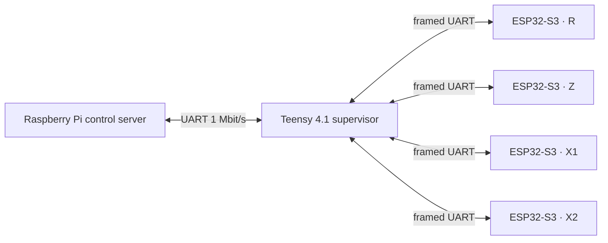

# ScanBot3000 Firmware

Distributed motion-control firmware for the ScanBot3000 Teensy 4.1 supervisor and ESP32-S3 axis controllers.


This repository contains the embedded firmware that drives the physical ScanBot3000 motion system. A Teensy 4.1 acts as the motion supervisor and console host; ESP32-S3 controllers drive individual axes, sensors, displays, and local indicators.

> **Project home:** [DreamMakers2/Scanbot3000](https://github.com/DreamMakers2/Scanbot3000)  
> **Control server:** [ScanBot3000-control](https://github.com/DreamMakers2/ScanBot3000-control)  
> **Kinematics UI:** [ScanBot3000-kinematics](https://github.com/DreamMakers2/ScanBot3000-kinematics)

## 🧩 Architecture



The Teensy aggregates telemetry, runs coordinated motion and homing logic, exposes a command console, and mirrors that console to the Raspberry Pi. Each ESP32-S3 axis controller manages a TMC2209 stepper driver plus the sensors and local UI assigned to that axis.

The PlatformIO environment names `teensy41_Beata` and `esp32s3_Anna` are retained firmware target codenames used by the source layout; they are not hostnames, network identifiers, or deployment credentials.

## 🚀 Getting started

Install PlatformIO Core or the VS Code PlatformIO extension, then clone this repository:

```bash
git clone https://github.com/DreamMakers2/ScanBot3000-firmware.git
cd ScanBot3000-firmware
```

Build the ESP32-S3 axis firmware:

```bash
pio run -e esp32s3_Anna
```

Build the Teensy 4.1 supervisor firmware:

```bash
pio run -e teensy41_Beata
```

Upload a connected target with:

```bash
pio run -e <environment> -t upload
```

The ESP32-S3 USB monitor and Teensy USB console use `115200` baud. Axis-controller links and the Teensy-to-Raspberry-Pi mirror run at `1,000,000` baud in the verified project configuration.

See [docs/SETUP.md](docs/SETUP.md) for wiring, build, upload, and first-test steps.

## Hardware implemented by this firmware

The repository evidence describes the following verified project configuration:

- Teensy 4.1 motion supervisor.
- ESP32-S3 DevKitC-1 class axis controllers.
- TMC2209 stepper driver on each axis controller.
- DS18B20 temperature probe and debounced limit switch per axis controller.
- SSD1306 OLED and WS2812B local indicators.
- AS5600 magnetic encoder on non-R axes.
- VL6180X time-of-flight range sensor on axis R, with a dedicated NeoPixel activity indicator.
- Physical logical axes `R`, `Z`, `X1`, and `X2`; virtual coordinated `X` and `P` axes are derived by the Teensy.

Exact motor models, mechanical loads, supply sizing, and complete machine BOM are not established by this firmware repository alone. See [docs/REQUIREMENTS.md](docs/REQUIREMENTS.md).

## Motion and command surface

The Teensy console implements configuration, jog, homing, coordinated absolute moves, range measurement, driver control, LED control, stop, and telemetry commands. Important commands include:

| Command | Purpose |
| --- | --- |
| `pos` | Report X/Z/P/R position state and homed flag. |
| `home z` | Run the host-side homing sequence. |
| `move <axis> <steps> <velocity> [acceleration]` | Relative open-loop move. |
| `moveto <axis> <deg>` | Move an axis toward an absolute encoder angle. |
| `moveabs [x ...] [z ...] [p ...] [r ...]` | Coordinated absolute move; X/Z/P require homing. |
| `coordstatus` | Report coordinated-motion state and errors. |
| `maxvelocity` / `maxaccel` | Query or set global/per-axis motion caps. |
| `driverstatus` / `driversettings` | Query or change physical-axis driver state. |
| `measure r <seconds>` | Stream VL6180X range samples on the R axis. |
| `stop [axis]` | Stop one axis or all motion; global stop clears the coordinated queue. |

The current firmware reports range measurements at a 20 ms sampling interval (50 Hz nominal scheduling). See [docs/pi_uart_console.md](docs/pi_uart_console.md) for the established serial workflow and command details.

## 🔒 Security and physical safety

The serial command interfaces are not authentication boundaries. Any connected host that can write to the control UART can command physical movement. Do not expose the downstream control API or a serial bridge directly to an untrusted network.

Before applying power or enabling drivers, verify wiring, travel limits, motor direction, emergency-stop access, and safe clearances. Software stop controls are not a substitute for an independent hardware emergency-stop strategy where one is required.

Read [SECURITY.md](SECURITY.md) before connecting real hardware.

## Documentation

- [Setup](docs/SETUP.md) — build, wiring, upload, and first-run workflow.
- [Requirements](docs/REQUIREMENTS.md) — verified hardware/software and unknown minimums.
- [Architecture](docs/ARCHITECTURE.md) — component boundaries and data flow.
- [UART console](docs/pi_uart_console.md) — serial wiring and command operations.
- [Troubleshooting](docs/TROUBLESHOOTING.md) — issues evidenced by project history and current behavior.
- [Prompting](docs/PROMPTING.md) — safe AI/agent prompt patterns for firmware work.
- [Public release checklist](docs/PUBLIC_RELEASE_CHECKLIST.md) — sanitization and release verification.
- [Contributing](CONTRIBUTING.md) — contribution rules.
- [Security](SECURITY.md) — security and vulnerability guidance.

## Repository layout

```text
.
├── src/
│   ├── teensy41_Beata/       # Teensy 4.1 motion supervisor
│   └── esp32s3_Anna/         # ESP32-S3 axis-controller firmware
├── lib/                       # shared project libraries/protocol code
├── include/                   # shared headers
├── docs/                      # operating and public-release documentation
├── platformio.ini             # PlatformIO environments and dependencies
└── CHANGELOG.md
```

## License

Licensed under the Apache License 2.0 with the Commons Clause License Condition v1.0. Internal business use, modification, and redistribution are permitted under the license terms; selling the software itself or offering a product or service whose value derives substantially from the software is restricted. See [LICENSE](LICENSE).
