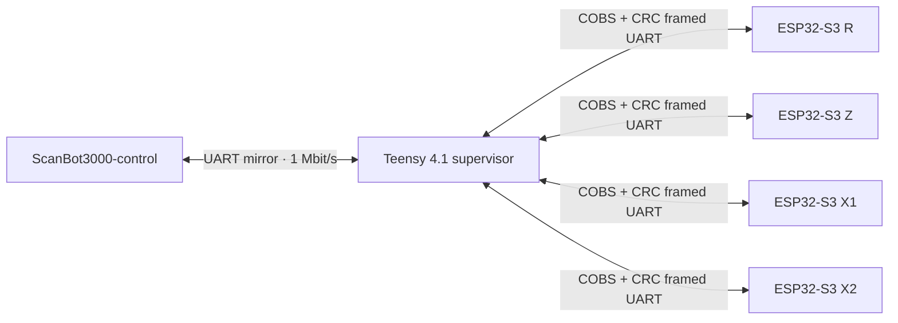

# Firmware Architecture

## Component boundary

This repository owns the embedded control layer only. The browser and Raspberry Pi control server are maintained in separate repositories.

## Teensy supervisor

The Teensy 4.1 aggregates axis telemetry, exposes the console, manages coordinated motion, tracks homing state, enforces the documented X/Z/P soft limits for coordinated moves, and mirrors console traffic to the Raspberry Pi over Serial8.

## ESP32-S3 axis controller

Each ESP32-S3 controller drives a TMC2209 and local UI/sensors. Non-R axes use AS5600 angle sensing; the R axis uses a VL6180X range sensor in place of the encoder path described by the current source.

## Interfaces

- Teensy USB console: 115200 baud.
- Teensy ↔ Raspberry Pi Serial8 mirror: 1,000,000 baud, 8N1 in the established deployment.
- ESP32-S3 ↔ Teensy axis links: 1,000,000 baud framed serial protocol.
- Shared protocol definitions are kept under `lib/`.

Network transport, authentication, and HTTP/WebSocket behavior are outside this repository and live in `ScanBot3000-control`.
